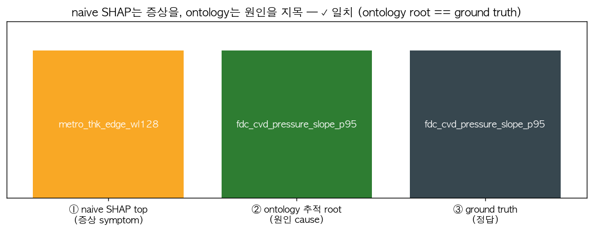
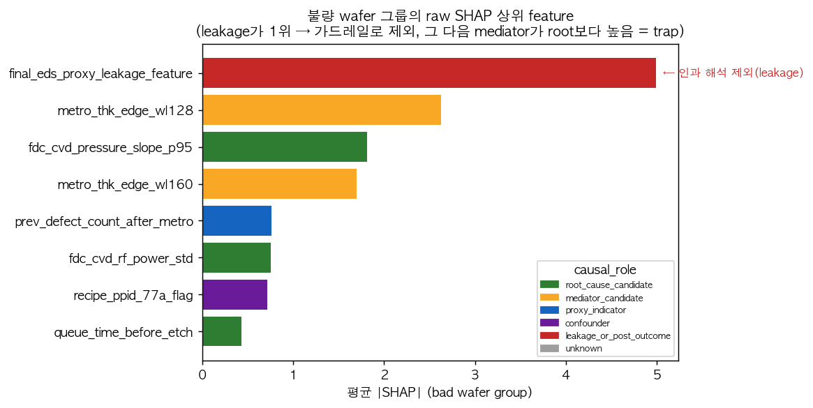
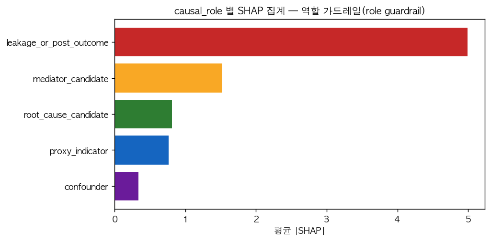
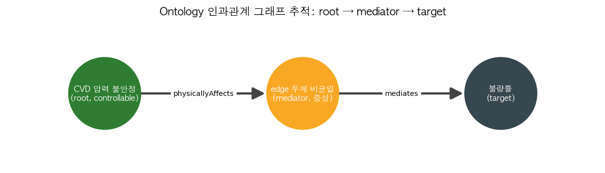
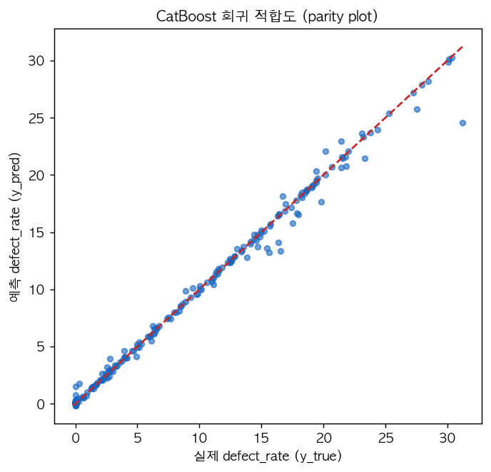

# 반도체 수율 분석을 위한 Ontology 기반 SHAP 해석 데모

> **Ontology-driven SHAP Root-Cause Demo for Semiconductor Yield** — 매니저 컨셉 데모(concept demo)

raw SHAP 결과를 **공정 맥락의 검증 가능한 인과 *가설(causal hypothesis)*** 로 끌어올리고,
나아가 **naive SHAP가 가리키는 상관 증상(correlated symptom)을 상류 진짜 원인(root cause)으로 교정**하여
**알려진 ground truth로 검증(✓)** 하는 과정을 보여줍니다.

> ⚠️ **SHAP은 인과를 증명하지 않습니다.** 본 데모는 ontology(= feature 메타데이터 + 인과관계 그래프)를
> 이용해 raw SHAP feature를 인과 *가설*로 변환하며, 최종 검증은 엔지니어가 수행합니다.
> 모든 카드는 "인과 가설(causal hypothesis)"이라 표기하며 "확정 원인(confirmed root cause)"이라 하지 않습니다.

---

## 1. 핵심 결과 한눈에 (evaluation result)

합성 데이터에는 **알려진 인과 사슬(ground-truth chain)** 이 심어져 있습니다:

```
fdc_cvd_pressure_slope_p95   (root, controllable · CVD_CH_03 / PPID_77A 집중)
   --physicallyAffects-->   metro_thk_edge_wl128/160   (mediator = edge 두께 비균일)
   --mediates-->            defect_rate                (target = 불량률)
```

여기에 **함정(trap)** 이 있습니다: mediator(edge 두께)가 target과 **가장** 상관이 높도록 설계되어,
TreeSHAP는 mediator를 1순위로 지목합니다. 즉 **naive SHAP는 "증상"을 원인으로 착각**합니다.
ontology 인과관계 그래프를 상류로 추적하면 controllable한 진짜 원인(CVD 압력 불안정)에 도달하고,
이는 ground truth와 **일치(✓)** 합니다.



| | naive SHAP #1 | ontology 추적 root | ground truth | 판정 |
|---|---|---|---|---|
| feature | `metro_thk_edge_wl128` (증상/mediator) | `fdc_cvd_pressure_slope_p95` (원인/root) | `fdc_cvd_pressure_slope_p95` | **✓ 일치** |

> 실제 실행값: `corr(target, mediator)=0.888 > corr(target, root)=0.882` → 함정 성립.
> 모델은 **CatBoost** 회귀, **TreeSHAP** 로 실제 SHAP을 1회 계산(test R² ≈ 0.98).

---

## 2. 평가 과정 시각화 (evaluation process)

### 2-1. 불량 wafer 그룹의 raw SHAP — 함정과 가드레일
누설(leakage) feature가 raw SHAP 1위입니다(=target에서 파생). 이를 **가드레일로 제외**하면
그 다음 1위는 **mediator(edge 두께)** 이고, 진짜 원인인 **root(CVD 압력)** 보다 높습니다 → 이것이 함정.



### 2-2. causal_role 별 SHAP 집계 — 역할 가드레일(role guardrail)
모든 feature를 `root_cause_candidate / mediator_candidate / proxy_indicator / confounder /
leakage_or_post_outcome` 중 하나로 분류해 인과 해석의 안전장치를 만듭니다.



### 2-3. Ontology 인과관계 그래프 추적 — 증상에서 원인으로
`causal_edges.csv`(명시적 DAG)를 **networkx로 상류 추적**하여 mediator → root를 도출합니다.



### 2-4. 모델 적합도 (CatBoost parity)


---

## 3. 왜 ontology가 SHAP 해석을 개선하는가

| 단계 | raw SHAP만 사용 | + Ontology |
|---|---|---|
| ① 출력 | feature **ID** 와 기여도 숫자뿐 | feature 메타데이터로 **공정 맥락 번역** (source/step/module/region) |
| ② 역할 | 상관/기여 구분 없음 | **causal_role 가드레일**: root/mediator/proxy/confounder/leakage 분리 |
| ③ 누설 | target 파생 feature가 SHAP 지배 | **leakage 제외** 가드레일로 인과 해석에서 배제(가시성은 유지) |
| ④ 원인 | 가장 큰 feature(=증상) 지목 | **인과관계 그래프 추적**으로 상류 controllable 원인 지목 |
| ⑤ 결과 | "edge 두께가 중요" (검증 불가) | **검증 가능한 인과 *가설*** + 권장 검증 + 등급(A/B/C/X) |

**두 가지 설계 기둥(design pillars)**
1. **진짜 ontology** — 단순 태깅이 아니라, feature 메타데이터 사전 + **명시적 인과관계 그래프**(`causal_edges.csv`).
   가설 엔진은 라벨을 나열하는 게 아니라 그래프를 **traverse** 하여 증거 경로를 *유도*합니다.
2. **검증 가능한 교정** — mediator가 root보다 target과 더 상관되도록 데이터를 설계해 naive SHAP가 일부러 틀리게 만들고,
   ontology 추적 결과를 ground truth로 **✓/✗ 검증**합니다.

---

## 4. 데이터 스키마 (data/)

| 파일 | 내용 |
|---|---|
| `feature_matrix.csv` | wafer별 feature 값 (FDC/Metrology/MES/EDS 등) |
| `target.csv` | `defect_rate`, `bad_flag` |
| `shap_values.csv` | **실제 TreeSHAP** (long): feature_id, feature_value, shap_value, abs_shap_value, shap_direction |
| `feature_dictionary.csv` | feature 메타데이터 + **`causal_role`**, leakage_risk, controllability, mechanism_group, KO 템플릿 |
| `causal_edges.csv` | **인과관계 그래프(DAG)**: `physicallyAffects / mediates / propagatesTo / triggers / proxyOf` + confidence |
| `process_history.csv` | CVD·Etch step 이력 (bad wafer는 `CVD_CH_03` / `PPID_77A` 집중) |
| `engineer_feedback.csv` | 엔지니어 피드백 샘플(앱에서 read-only) |
| `ground_truth.csv` | 알려진 진짜 root cause(검증용) |

> `causal_edges.csv` 첫 줄에는 주석이 있습니다: *"이 파일을 편집해 도메인 인과관계를 추가/수정한다 (ontology market)."*

산출물 `outputs/`: `demo_hypothesis_cards.csv`, `ontology_level_shap_summary.csv`.

---

## 5. 실행 방법 (how to run)

> 데이터 생성 시에만 `catboost`/`shap` 가 필요합니다(파이썬 3.10 권장).
> **Streamlit 앱은 CSV만 읽으므로** catboost/shap 없이도 동작합니다.

```bash
# 1) 가상환경 (실제 SHAP을 위해 Python 3.10 권장)
python3.10 -m venv .venv
source .venv/bin/activate

# 2) 의존성 설치
pip install -r requirements.txt

# 3) 데이터 + 실제 SHAP + 가설 카드 + README 이미지 생성
python run_demo.py

# 4) 대시보드 실행 (오프라인)
streamlit run app.py
```

`run_demo.py` 는 종료 시 **ACCEPTANCE CHECK** 를 출력합니다:
naive top-SHAP(=mediator) vs ontology root vs ground truth **✓**, 필수 CVD 카드 존재, leakage 제외 확인.

> `catboost`/`shap` 가 설치 불가한 환경이면, ground-truth 패턴과 일관된 **결정론적 합성 SHAP 폴백**으로
> 자동 전환되며 그 사실이 로그에 표시됩니다(앱 동작은 동일).

---

## 6. 매니저 프레젠테이션 스토리

> **raw SHAP는 feature ID만 보여준다 → ontology 매핑이 공정 맥락으로 번역 →
> 인과 role 가드레일이 root/mediator/proxy/confounder/leakage를 분리 →
> 인과관계 그래프 추적으로 증상이 아닌 상류 원인을 지목 → 검증 가능한 인과 *가설* 생성.**

대표 카드(예시): **"CVD 압력 불안정(pressure instability) → edge 두께 비균일(non-uniformity) → 불량률 상승"**,
등급 ~**B**, `CVD_CH_03` 집중 명시, `PPID_77A` 는 confounding 위험으로 표시.

---

## 7. Feature / Ontology Market 운영 모델 (governance)

| 책임 주체(Owner) | 관리 정보(Maintained Info) | 업데이트 트리거(Update Trigger) |
| --- | --- | --- |
| Data Analytics 팀 | feature_id, source_type, aggregation, leakage risk, 모델 사용 여부 | 신규 feature/모델 릴리스 |
| 제품 엔지니어 | target 의미, defect bin 해석, 제품별 민감도 | 신규 제품/ECO |
| 공정 엔지니어 | 공정 메커니즘, step 관계, controllability, 조치 가이드 | 공정/recipe/tool 변경 |
| 설비 엔지니어 | chamber/tool 거동, FDC 해석, PM 연관 | tool 이슈/PM/변경 |
| YE 엔지니어 | 가설 피드백, 검증 결과, case memory | 이슈 리뷰/조치 후 |

> 기본 골격은 Data Analytics 팀이 CSV로 시딩하고, 심도 있는 인과관계는 제품·공정·설비 엔지니어가
> 주기적으로 채워 **자산(asset)** 으로 축적한다. `causal_edges.csv` / `feature_dictionary.csv` 를 편집하는 것이
> 곧 ontology를 키우는 일이며, 이것이 "feature/ontology market" 의 출발점이다.

---

## 8. 저장소 구조

```text
ontology_demo_claude/
  README.md  requirements.txt  app.py  run_demo.py
  src/        data_generator · loaders · ontology_mapping · shap_interpreter · hypothesis_engine · visualization
  scripts/    make_readme_assets.py        # README 결과 이미지 생성
  data/       *.csv  (feature_matrix, target, shap_values, feature_dictionary, causal_edges, ...)
  outputs/    demo_hypothesis_cards.csv · ontology_level_shap_summary.csv
  docs/assets/ *.png                        # README 임베드 결과 이미지
```

*Concept demo only — not production. 재현성: 고정 seed, 오프라인, 외부 API/DB/LLM 미사용.*
