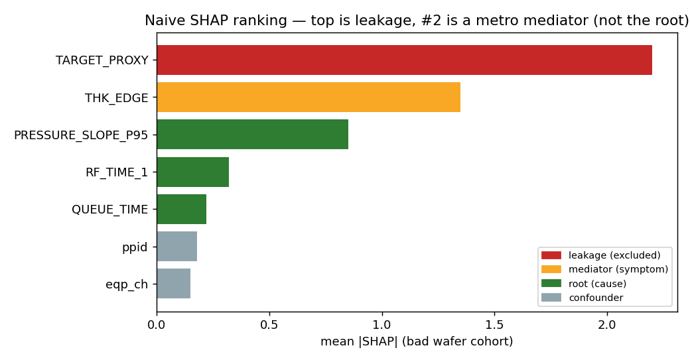
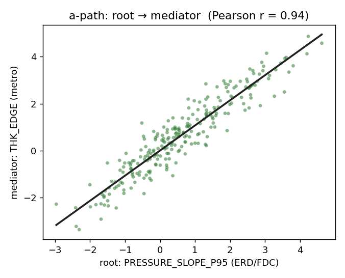
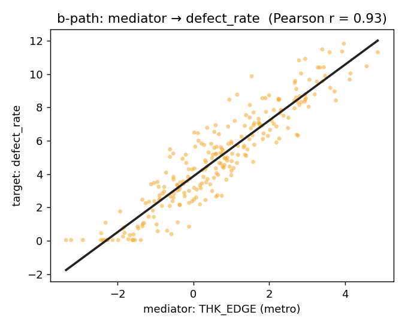
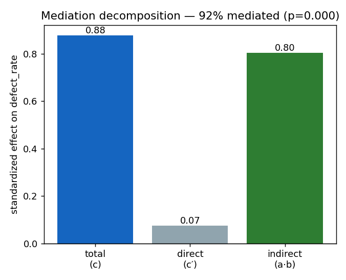
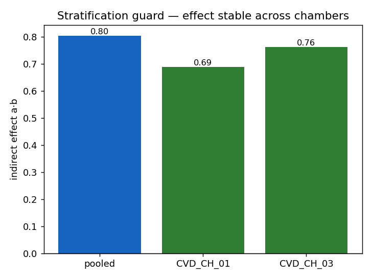
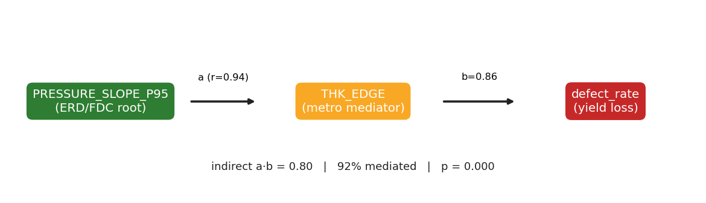

# 가상 데이터 실험 리포트 — SHAP 랭킹에서 측정된 인과 사슬로

이 문서는 측정 레이어(`src/causal_evidence.py`)를 검증하기 위해 **가상 데이터로 진행한 실험의 과정과 결과**를 시각화와 함께 정리한 것입니다. 실데이터 적용 전에 "측정된 인과 사슬이 실제로 복원되는가"를 눈으로 확인하는 용도입니다.

- 재현: `python scripts/make_experiment_charts.py` (차트 생성) / `python run_demo.py --mode virtual` (전체 파이프라인)
- 차트 원본: [`docs/experiment_assets/`](experiment_assets/)
- 관련 문서: 진단·개선 배경은 [diagnosis_and_improvement_plan.md](diagnosis_and_improvement_plan.md), 사용법은 [team_usage_guide.md](team_usage_guide.md)

---

## 1. 실험 설계 — 정답(ground truth)을 심은 가상 데이터

`src/virtual_data_generator.py`는 회사 데이터와 동일한 입력 계약(naming rule)을 따르되, **정답 인과 구조를 의도적으로 심어** 둡니다. 핵심은 *root가 target에 직접 영향을 주지 않고 오직 mediator를 통해서만 영향을 준다* 는 점입니다(= 완전 매개, 정답 `% mediated ≈ 100%`).

```python
root     = N(0,1) + exposed*2.2                       # ERD/FDC 센서 (PRESSURE_SLOPE_P95)
mediator = 1.1*root + N(0,0.55)                        # metro 계측 (THK_EDGE)  ← root가 움직임
target   = 5 + 2.8*z(mediator) + 0.7*z(queue) + N(0,0.9)   # 불량률 ← mediator가 움직임
leakage  = target + N(0,0.2)                           # target에서 파생된 누설 feature
```

그리고 SHAP은 일부러 **누설 > 매개 > 원인** 순서로 큰 값을 갖도록 부여했습니다(실데이터에서 흔한 함정 재현).

| feature | 역할 | 부여한 mean SHAP |
|---|---|---|
| `num\|FINAL\|TARGET_PROXY\|VALUE` | leakage | **2.20** |
| `num\|MET_CVD\|THK_EDGE\|AVG` | mediator (증상) | 1.35 |
| `num\|CVD\|erd\|pcf\|PRESSURE_SLOPE_P95\|CVD` | root (원인) | 0.85 |
| `num\|CVD\|RF_TIME_1\|VALUE` | VM root | 0.32 |
| `num\|ETCH\|QUEUE_TIME\|VALUE` | 직접 root | 0.22 |

데이터 규모: **wafer 250개, bad wafer 50개(target 상위 20%)**.

---

## 2. 문제 재현 — 왜 naive SHAP 랭킹이 오해를 부르는가

bad wafer cohort 평균 |SHAP|를 그대로 순위로 보면 다음과 같습니다.



- 1위는 **누설(TARGET_PROXY)** — target에서 파생된 값이라 원인 분석에서 제외해야 합니다(가드레일).
- 누설을 빼도 1위는 **THK_EDGE(계측 = 증상/mediator)** 이지 원인이 아닙니다.
- 진짜 상류 원인 **PRESSURE_SLOPE_P95(ERD/FDC)** 는 3위로 밀려 있습니다.

즉 SHAP 순위만 보면 "THK_EDGE가 중요하다"에서 멈추고, **무엇이 THK_EDGE를 움직였는지(=조치 가능한 원인)** 로 못 갑니다. 이것이 기존 프로토타입이 "SHAP 순서와 별 차이 없다"고 느껴졌던 지점입니다.

---

## 3. 측정 기법 — raw 데이터로 인과 사슬을 측정

SHAP은 feature별 평균 한 줄이라 관계를 측정할 수 없습니다. 대신 `raw_data`의 **wafer별 값**으로 두 경로를 직접 측정합니다(표준화 후 단순/2-변수 OLS, scipy 없이 닫힌형).

### a-path: root → mediator

표준화 단순회귀 기울기 = Pearson r. ERD 센서가 실제로 계측값을 움직이는지를 측정합니다.



### b-path: mediator → target

계측값이 불량률을 움직이는지를 측정합니다.



### 매개분해(mediation) — indirect = a·b, 그리고 얼마나 매개되는가

`target ~ mediator + root` 2-변수 표준화 회귀로 b(직접 매개)와 c′(root 직접효과)를 구하고, 총효과 c와 비교합니다.

```python
# src/causal_evidence.mediation — 핵심
a        = corr(root, mediator)                       # root → mediator
c_total  = corr(root, target)                         # root → target (총효과)
b, c'    = OLS(target ~ mediator + root)              # 2-변수 표준화 회귀
indirect = a * b                                      # 매개효과 (= c_total - c')
prop_mediated = indirect / c_total                    # 전체효과 중 매개 비율
# 유의성: Sobel z = a*b / sqrt(b^2 se_a^2 + a^2 se_b^2), 정규근사 p
```



총효과 0.88 중 **직접효과는 0.07로 거의 0**, **매개효과 a·b = 0.80** 으로 사실상 전부가 THK_EDGE를 통해 흐릅니다 → 정답(완전 매개)을 그대로 복원했습니다.

### 교란 가드 — 챔버 층화(Simpson)

전체 평균에서 강해도 특정 챔버 mix 때문에 생긴 가짜 효과일 수 있어, chamber별로 다시 측정해 부호가 유지되는지 확인합니다.



pooled(0.80) 대비 CVD_CH_01(0.69), CVD_CH_03(0.76) 모두 같은 방향으로 유지 → `strata_stable = True`. (반대로 모든 층에서 약화/역전되면 등급 상한을 C로 낮춥니다.)

---

## 4. 결과 — 측정된 인과 사슬



측정값(표준화):

| 지표 | 값 | 의미 |
|---|---|---|
| a (root→mediator, r) | **0.938** | ERD 압력이 edge 두께를 강하게 움직임 |
| b (mediator→target) | **0.857** | edge 두께가 불량률을 강하게 움직임 |
| c_total (총효과) | 0.878 | root의 불량률 총효과 |
| c_direct (직접효과) | 0.074 | root의 비매개 직접효과 ≈ 0 |
| indirect (a·b) | **0.804** | 측정된 매개효과 |
| prop_mediated | **0.916** | 전체효과의 약 92%가 THK_EDGE를 통해 매개 |
| indirect_p (Sobel) | **0.000** | 유의 |

파이프라인이 만든 카드(HYP_001)는 **Grade A**, evidence path는:

```
num|CVD|erd|pcf|PRESSURE_SLOPE_P95|CVD ↑ → num|MET_CVD|THK_EDGE|AVG (r=0.938)
  → 불량률 (indirect a·b=0.804, 전체효과의 92% 매개, p=0.000)
```

---

## 5. naive SHAP vs 측정 결과 비교

| 관점 | 지목 대상 | 한계/추가정보 |
|---|---|---|
| naive SHAP #1 (누설 제외) | `THK_EDGE` (mediator) | 증상까지만. 원인·크기 없음 |
| **측정 추적 root** | `PRESSURE_SLOPE_P95` (ERD root) | **r=0.94로 THK_EDGE를 구동, 92% 매개** |
| 정답(ground truth) | `PRESSURE_SLOPE_P95` | 일치 ✓ |

→ SHAP은 "어디를 볼지" 우선순위를 주고, 측정 레이어가 "그 증상을 만든 조치 가능한 원인과 그 크기"를 데이터로 제시합니다. 원하셨던 *"FDC 센서 → thk/cd 변동 → 불량률"* 형태가 숫자와 함께 나옵니다.

---

## 6. 한계와 다음 단계

- 현재 SHAP은 cohort 평균뿐이라, 인과 크기는 전부 raw per-wafer 값으로 측정합니다. **per-wafer SHAP**을 받으면 "root는 측정상 효과가 큰데 모델 SHAP은 낮다 = mediator가 credit 흡수"를 직접 정량화할 수 있습니다(왜 SHAP 랭킹이 상류 원인을 놓쳤는지 증명).
- 측정은 상관 기반이므로 **확정 인과가 아니라 가설**입니다. chamber FDC 트렌드·A/B 검증이 뒤따라야 합니다.
- root×metro 쌍이 많아지면 다중비교 보정(효과크기 우선 + BH 플래그)이 필요합니다.
